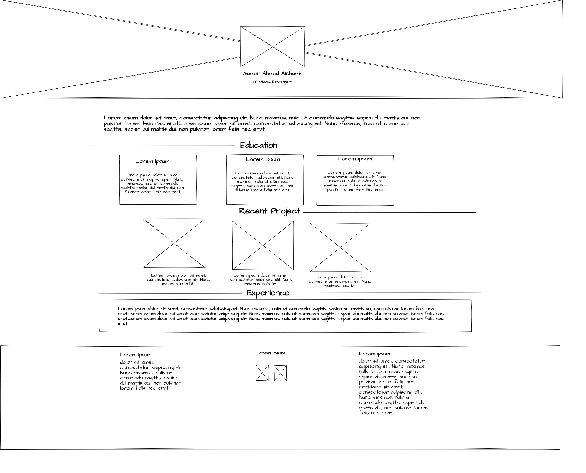
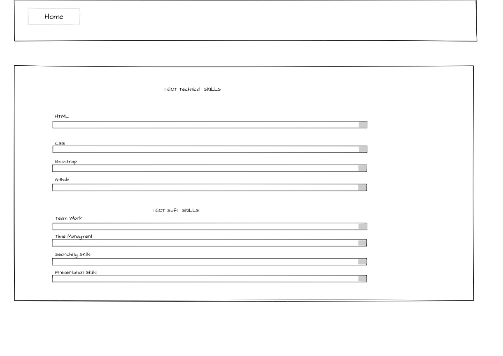

# Portfolio Project #1

## My Portfolio website that allow you to see my education & project I made it & what experience I have .
## The language I used  :
1. HTML
2. CSS 
3. Bootstrap

[livelink](https://samaralkhamis.github.io/Projects/)
[MocKup Link](https://www.figma.com/file/PHBarhWXbFWISqtsA9iz04/Untitled?node-id=0%3A1)

## WireFrame Page 1

## WireFrame Page 2

